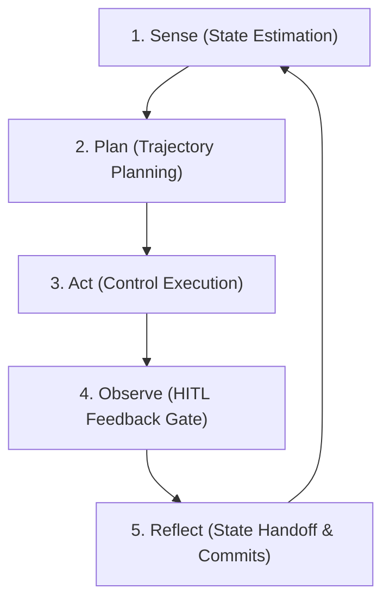

# Coherence Validation: Terminology Alignment

This document performs a structural and logical coherence validation of our ecosystem's terminology. It mathematically anchors our operational constructs to **Graph Theory** and **Agentic Control Loops** to prevent semantic drift.

---

## 1. Topological Graph Theory Alignment

Our repository state-space is mathematically modeled as a **Directed Acyclic Graph (DAG)**, denoted as $G = (V, E)$, where:
* $V$ is the set of **Vertices (Nodes)** representing discrete repository state transitions.
* $E$ is the set of **Edges (Directed Dependencies)** representing the topological ordering constraint: $u \to v$ means $u$ must be completed before $v$ can start.

### Terminology Mapping & Validation

#### Node (Vertex $v \in V$)
* **Definition**: An atomic, isolated state transition in the repository.
* **Topological Coherence**: Pristine. A single step on the frontier of $G$. In git, this translates to a single commit chain merged via PR.
* **Agile Mapping**: Replaces "Task" or "User Story".

#### Path (Directed Path $P \subseteq G$)
* **Definition**: A themed sequence of dependent Nodes $P = (v_1, v_2, \dots, v_k)$ where $(v_i, v_{i+1}) \in E$ for all $1 \le i < k$.
* **Topological Coherence**: Pristine. Replaces **"Epic"** (which is an agile marketing term with zero mathematical meaning). A Path has a clear direction, a start node, and a terminal node, perfectly describing how a complex capability is bootstrapped step-by-step.
* **Agile Mapping**: Replaces "Epic".

#### Probe (Diagnostic Vertex/Sub-graph)
* **Definition**: A time-boxed, purely investigatory Node that explores a specific state space.
* **Topological Coherence**: Pristine. Replaces **"Spike"** (which is XP jargon). In system and network theory, a "probe" is an informational query sent into the environment. A Probe Node mutates only the Knowledge Base (ROM memory $\text{kb/}$) and does not introduce functional logic. It resolves uncertainty before a normal Node mutates the production system.
* **Agile Mapping**: Replaces "Spike".

#### Backlog (Queue $Q \subset V$)
* **Definition**: The set of planned but unexecuted Nodes.
* **Topological Coherence**: Pristine. Because the backlog is dependency-linked, it represents the set of nodes $v$ whose in-degree $\text{in-deg}(v) > 0$ because of uncompleted ancestors. A node becomes **Ready** when all its ancestors are completed, reducing its active in-degree to 0.

---

## 2. SPAO Control Loop Alignment

The **Sense-Plan-Act-Observe-Reflect** loop is our Agentic Control Loop. It maps directly onto classical state estimation and feedback control:

### Loop-Term Coherence

* **Sense**: Estimates the current state of $G$ and the active workspace, surfacing ready nodes in the Queue $Q$.
* **Plan**: Formulates the execution contract by activating a Node Issue, setting its feedforward invariants, and linking it to the Path Issue.
* **Act**: Mutates the physical system (logic, tests) under strict local TDD invariants.
* **Observe**: The feedback loop pauses for a Human-In-The-Loop (HITL) gatekeeper review.
* **Reflect**: Finalizes state transition. Closes the micro-ledger, opens a PR, updates the Path Meta-Index, and hands over to the next loop iteration.

---

## 3. Coherence Verification Matrix

| Term | Domain | Aligned? | Semantic Integrity |
|---|---|---|---|
| **Node** | Graph Theory | Yes | Represents a single vertex in the DAG of codebase evolution. |
| **Path** | Graph Theory | Yes | Represents a directed sequence of dependent vertices (replaces "Epic"). |
| **Probe** | Systems Theory | Yes | Represents an informational query/exploration (replaces "Spike"). |
| **Pillar** | Architecture | Yes | Represents a top-level isolated namespace (`kb/`, `skills/`, etc.). |
| **Primitive** | Linguistics | Yes | Represents the atomic types of reasoning documents (`WHAT`, `WHY`, `HOW`). |
