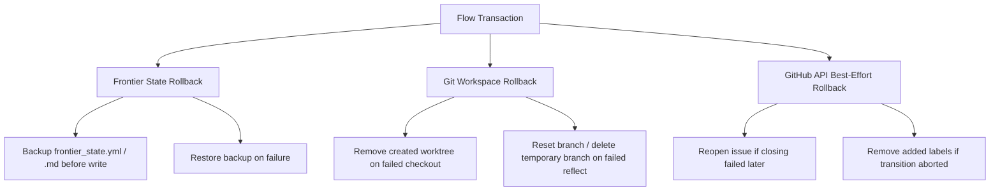

# WHY-0026: Abstraction Doctrine Remediation & Atomic Transaction Lifecycle

## Context & Rationale
While Path 341 introduced wrapper interfaces for basic Git and GitHub operations, our subsequent audit surfaced that several orchestrator files (`node_lifecycle.py`, `daemon_node.py`, and `daemon_telemetry.py`) still execute raw shell commands directly. This bypasses the Abstraction Doctrine, exposing the system to:
- Test fragility due to incomplete subprocess mocking.
- Inconsistent state tracking between git, frontier state files, and remote GitHub issues.

Furthermore, state mutations (e.g. planning, checking out, and reflecting nodes) are currently non-atomic. If a failure occurs midway through an orchestration phase (e.g., a GitHub API rate limit during PR creation after local state has been updated), the system is left in a corrupted/dissonant state.

We need a formal design to:
1. Remediate remaining raw git/gh subprocess executions.
2. Introduce transactional properties (Atomicity, Consistency, Isolation, Durability) to node state transitions, enabling safe rollbacks on failures.

## Architectural Decision

### 1. Complete Abstraction Doctrine Remediation
We will expand the wrappers under `drivers/` to encapsulate all required operations, fully removing direct subprocess invocations of `git` and `gh` from the orchestrator layer.

#### Target Extensions for `drivers/git_client.py`:
- `switch(branch: str)`: Encapsulates `git switch`.
- `pull(remote: str, branch: str, prune: bool = False)`: Encapsulates pulling with optional pruning.
- `list_merged_branches() -> list[str]`: Encapsulates querying merged local branches.
- `list_local_branches() -> list[str]`: Encapsulates listing short names of all local branches.
- `worktree_prune()`: Encapsulates pruning of dead worktrees.
- `get_git_common_dir() -> str` & `get_show_toplevel() -> str`: Standardizes repository path resolution.

#### Target Extensions for `drivers/github_client.py`:
- Standardize the `get_issue_details` function to cleanly read specific issue schemas.

---

### 2. Transactional Rollback Architecture
We establish the concept of a **Flow Transaction** to wrap orchestration operations. The rollback capability will target three primary state vectors:

#### Core Components of the Transaction Layer:
1. **Context Manager Boundary**: Orchestrator commands will be wrapped in a transaction block (e.g. `with FlowTransaction() as tx:`).
2. **State Backups**:
   - **Local Ledger Backup**: Before any change to `frontier_state.yml`, a copy of the state is stored in memory or in a temporary file. If the transaction raises an exception, the file is restored and re-hashed.
   - **Git Rollback Actions**: Track side-effects (e.g. checking out worktrees, creating branches). Register reverse-operations (e.g., `git_client.worktree_remove`, `git_client.branch_delete`) in a rollback queue.
   - **GitHub API Rollback Actions**: Track mutations (e.g., adding labels, closing issues). Register reverse-calls (e.g. `github_client.remove_label`, `github_client.reopen_issue`) to be executed in reverse order on failure.
3. **Execution Safety**: Rollbacks must run inside robust try-except blocks to ensure a failure in one rollback step does not block other rollbacks from executing.
