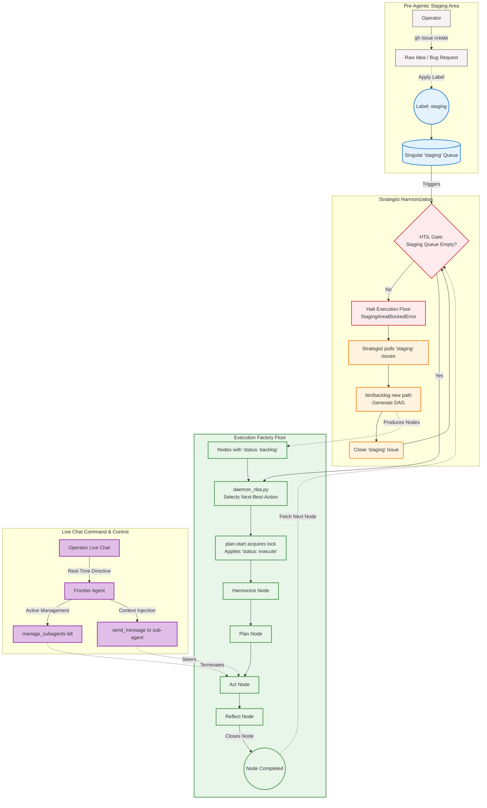

# The Work Lifecycle: Singular Staging & Live Swarm Command

This diagram illustrates the unified intake architecture, explicitly separating the Pre-Agentic Intake Queue from Active Swarm Steering. It demonstrates how raw ideas funnel through the `staging` queue and are formalizied by the Strategist, while the Operator exercises real-time command-and-control over the executing swarm via Live Chat.

## Key Architectural Principles

1. **The Singular Intake Queue:** The `staging` GitHub Issue label is strictly the Pre-Agentic Intake Queue. It holds unstructured bugs and feature requests awaiting formal DAG translation by the Strategist.
2. **The Passive Gate:** The engine cannot pull new nodes into execution if the `staging` queue is non-empty, guaranteeing that Operator intent is codified before allocating resources.
3. **Active Swarm Steering:** The legacy Prompt mechanism is retired. Real-time steering, course correction, and emergency braking of actively executing nodes are handled exclusively via **Live Chat**, where the asynchronous Frontier Agent can instantaneously terminate or message executing sub-agents.
